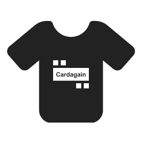

# Chinese Vocab

Configurable flash card platform with persistent state. 

# Todo

- [ ] Selection of english term in buildCards should look for:
    - Take two shortest words from ";" lists
    - Element with fewest words
    - Prefer lowest index
- [ ] In settings>more, show all hidden terms (for unhiding purposes)

# Resources

https://github.com/drkameleon/complete-hsk-vocabulary/tree/main

Figma: https://www.figma.com/design/UZ3b0IwJwPVfFKZ6HKzoKB/ChineseVocab?node-id=0-1&node-type=CANVAS&t=GrOxJQZ4RmdEJLbF-0